# Pyera App - User Flow Diagram

## Navigation Architecture

```mermaid
flowchart TD
    subgraph Entry["🚀 App Entry"]
        Start([App Launch]) --> Welcome
        Welcome[Welcome Screen] --> |Get Started| Onboarding
        Welcome --> |Have Account| Login
        Onboarding[Onboarding Pages] --> Auth
    end

    subgraph Auth["🔐 Authentication"]
        Login[Login Screen]
        Register[Register Screen]
        Login <--> Register
    end

    Auth --> Main

    subgraph Main["📱 Main App - Bottom Navigation"]
        Dashboard["🏠 Dashboard"]
        Transactions["📋 Transactions"]
        Budget["⭐ Budget"]
        Debt["⚠️ Debt"]
        Profile["👤 Profile"]
    end

    subgraph Secondary["📊 Secondary Screens"]
        Analysis[Analysis]
        Savings[Savings Goals]
        Bills[Bills]
        Investments[Investments]
        Chat[AI Chat]
        AddTransaction[Add Transaction]
    end

    Dashboard --> AddTransaction
    Dashboard --> Bills
    Dashboard --> Investments
    Dashboard <--> Transactions
    Dashboard <--> Budget
    Dashboard <--> Debt
    Dashboard <--> Profile
    Profile --> Savings
    Profile --> Analysis
    Profile --> Chat
    Transactions --> AddTransaction
```



---

## Bottom Navigation Tabs

| Tab      | Route          | Icon | Screen                |
| -------- | -------------- | ---- | --------------------- |
| Home     | `dashboard`    | 🏠   | DashboardScreen       |
| Activity | `transactions` | 📋   | TransactionListScreen |
| Budget   | `budget`       | ⭐   | BudgetScreen          |
| Debt     | `debt`         | ⚠️   | DebtScreen            |
| Profile  | `profile`      | 👤   | ProfileScreen         |

---

## Screen Details

### Entry Flow

| Screen     | Route        | Purpose                      |
| ---------- | ------------ | ---------------------------- |
| Onboarding | `onboarding` | First-time user introduction |
| Login      | `login`      | User authentication          |
| Register   | `register`   | New account creation         |

### Main Screens

| Screen       | Route          | Access From                   |
| ------------ | -------------- | ----------------------------- |
| Dashboard    | `dashboard`    | Bottom nav, start destination |
| Transactions | `transactions` | Bottom nav                    |
| Budget       | `budget`       | Bottom nav                    |
| Debt         | `debt`         | Bottom nav                    |
| Profile      | `profile`      | Bottom nav                    |

### Secondary Screens

| Screen          | Route             | Access From                 |
| --------------- | ----------------- | --------------------------- |
| Add Transaction | `add_transaction` | Dashboard FAB, Transactions |
| Analysis        | `analysis`        | Profile menu                |
| Savings         | `savings`         | Profile menu                |
| Bills           | `bills`           | Dashboard card              |
| Investments     | `investments`     | Dashboard card              |
| Chat            | `chat`            | Profile menu                |

---

## Key User Journeys

### 1. Add Transaction Flow

```
Dashboard → FAB → AddTransactionScreen → Save → Back to Dashboard
```

### 2. View Financial Health

```
Dashboard → Profile → Analysis → View Charts/Export Data
```

### 3. Manage Debt

```
Bottom Nav → Debt → Add/Edit Debt → Track Payments
```

### 4. Track Savings Goals

```
Profile → Savings → Create Goal → Add Contributions
```
